# 🚀 Task Suite Management System

A modern **Full-Stack Task Management and Collaboration Platform** designed to manage projects, assign tasks, track progress, monitor workload, and improve team productivity.

The application provides separate workflows for **Admin, Project Manager, and Employee**, with secure authentication, role-based access control, task tracking, notifications, dashboards, and a responsive user interface.

---

## 📌 Project Overview

The **Task Suite Management System** helps organizations manage their complete task workflow from project creation to task completion.

It allows:

* 👨‍💼 Admins to manage users, projects, approvals, and teams
* 📊 Project Managers to create and assign tasks
* 👨‍💻 Employees to manage assigned tasks and update progress
* 📈 Teams to monitor workload and productivity
* 🔐 Users to securely access the system using JWT or Google OAuth2

---

## ✨ Key Features

### 🔐 Authentication & Security

* User Registration
* Secure Login
* JWT Authentication
* Google OAuth2 Login
* Spring Security
* Role-Based Access Control
* Protected API Endpoints
* CORS Configuration

### 👨‍💼 Admin Module

* Admin Dashboard
* User Management
* User Approval
* Project Management
* Team Allocation
* System Project Management
* Audit Logs
* Security Management
* System Activity Monitoring

### 📊 Project Manager Module

* Project Dashboard
* Project-Based Task Management
* Create Tasks
* Assign Tasks to Employees
* Task Status Monitoring
* Workload Monitoring
* Team Capacity Tracking
* Kanban View
* Task Table View
* Bulk Task Management

### 👨‍💻 Employee Module

* Personal Dashboard
* Assigned Tasks
* Task Progress Tracking
* Priority Management
* Working Time Logging
* Task Status Updates
* Task Discussions
* Grid View
* Kanban View
* Weekly Capacity Logging

### 🎨 UI/UX Features

* Responsive Design
* Angular Material
* Light/Dark Mode
* Persistent Theme Preference
* Profile Management
* Profile Picture Upload
* Role-Based Notifications
* Search & Filtering
* Modern Dashboard Interface

---

# ⚙️ How the Application Works

## 1️⃣ User Authentication

Users can register and securely log in to the application.

The system supports:

* JWT Authentication
* Google OAuth2 Authentication
* Secure session handling
* Protected routes

### Authentication Flow

```text
User
  ↓
Login / Register
  ↓
Authentication
  ↓
JWT Token
  ↓
Role Verification
  ↓
Authorized Dashboard
```

---

## 2️⃣ Role-Based Access

After authentication, users are provided access based on their role.

```text
                    ┌──────────────┐
                    │     USER     │
                    └──────┬───────┘
                           ↓
                  Authentication
                           ↓
                 Role Verification
                           ↓
        ┌──────────────────┼──────────────────┐
        ↓                  ↓                  ↓
     ADMIN          PROJECT MANAGER       EMPLOYEE
        ↓                  ↓                  ↓
   Admin Panel        Manager Panel       Employee Panel
```

---

## 3️⃣ Project & Team Management

Admins manage the overall organization workflow.

Admin can:

* Create and manage projects
* Approve users
* Manage teams
* Allocate employees
* Monitor system activities
* Review project information

---

## 4️⃣ Task Assignment

Project Managers handle task planning and assignment.

```text
Project Manager
       ↓
Create Task
       ↓
Set Priority
       ↓
Assign Employee
       ↓
Set Status / Progress
       ↓
Employee Workspace
```

Project Managers can monitor:

* Total Tasks
* In-Progress Tasks
* Completed Tasks
* Overdue Tasks
* Employee Workload
* Team Capacity

---

## 5️⃣ Task Execution & Tracking

Employees can view their assigned tasks and manage their work.

Employees can:

* View task details
* Update task status
* Track progress
* Log working hours
* View priority
* Participate in discussions
* Switch between Grid and Kanban views

```text
Assigned Task
     ↓
Employee Views Task
     ↓
Work on Task
     ↓
Update Progress
     ↓
Log Working Time
     ↓
Update Status
     ↓
Task Completion
```

---

## 6️⃣ Monitoring & Notifications

The system provides dashboards and notifications for better visibility.

Users can monitor:

* Project progress
* Task status
* Employee workload
* Team capacity
* Notifications
* Productivity metrics
* Pending activities

---

# 🏗️ Application Architecture

```text
┌─────────────────────────────────────────┐
│             ANGULAR FRONTEND            │
│                                         │
│  Components | Services | Routing        │
│  Angular Material | Authentication      │
└────────────────────┬────────────────────┘
                     │
                     │ REST API
                     ↓
┌─────────────────────────────────────────┐
│          SPRING BOOT BACKEND            │
│                                         │
│  Controllers                            │
│  Services                               │
│  Repositories                           │
│  Spring Security                        │
│  JWT Authentication                     │
│  OAuth2                                 │
└────────────────────┬────────────────────┘
                     │
                     │ JPA / Hibernate
                     ↓
┌─────────────────────────────────────────┐
│               MYSQL DATABASE             │
│                                         │
│ Users | Projects | Tasks | Teams         │
│ Roles | Notifications | Activity Data   │
└─────────────────────────────────────────┘
```

---

# 🛠️ Technologies Used

### 💻 Frontend

* Angular
* TypeScript
* HTML5
* CSS3
* Angular Material

### ⚙️ Backend

* Java 21
* Spring Boot 3.2.5
* Spring Security
* Spring Data JPA
* Hibernate
* Lombok
* Maven

### 🔐 Security

* JWT Authentication
* Google OAuth2
* Role-Based Access Control
* CORS
* Protected REST APIs

### 🗄️ Database

* MySQL

### 🔧 Development Tools

* Git
* GitHub
* Visual Studio Code
* IntelliJ IDEA / Eclipse
* MySQL Workbench

---

# 📂 Project Structure

```text
Task_Management_System/
│
├── backend/
│   └── task-manager-backend/
│       └── task-manager-backend/
│           ├── src/
│           │   ├── main/
│           │   │   ├── java/
│           │   │   └── resources/
│           │   └── test/
│           │
│           ├── pom.xml
│           └── ...
│
├── frontend/
│   └── taskManagerFrontend/
│       ├── src/
│       │   ├── app/
│       │   ├── assets/
│       │   └── styles.css
│       │
│       ├── angular.json
│       ├── package.json
│       └── ...
│
├── screenshots/
│   ├── login.png
│   ├── admin-dashboard.png
│   ├── project-manager-dashboard.png
│   ├── employee-dashboard.png
│   ├── task-management.png
│   ├── kanban-view.png
│   ├── user-management.png
│   └── profile.png
│
└── README.md
```

---

# 🖥️ Application Screenshots

## 🔐 Login

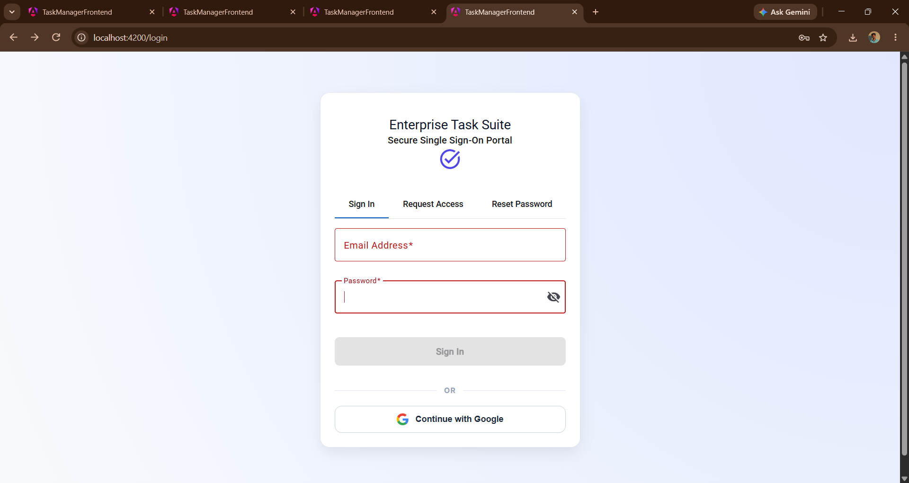

---

## 🔑 Google Login

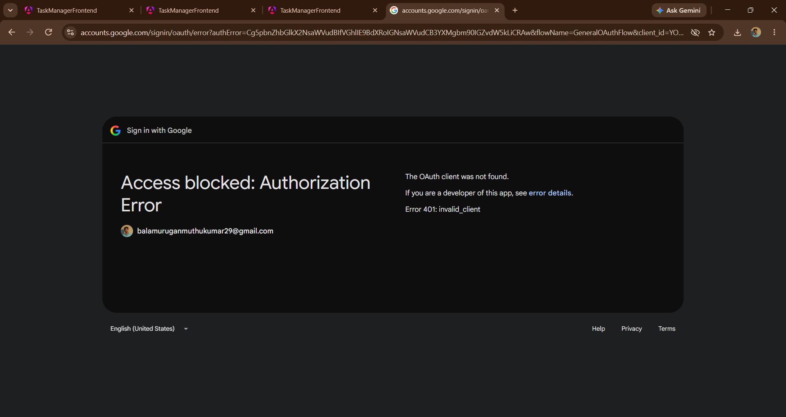

---

## 👨‍💼 Admin Dashboard

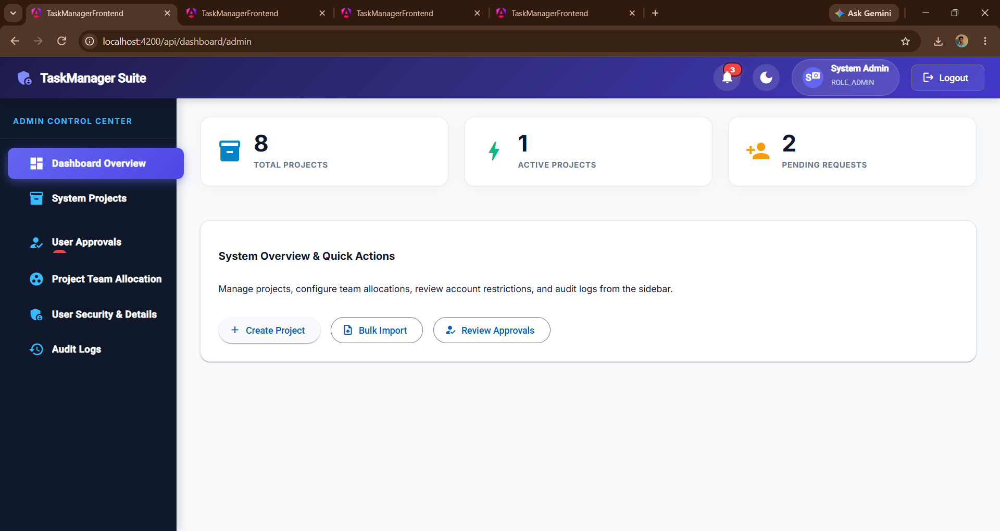

---

## 👥 User Approvals

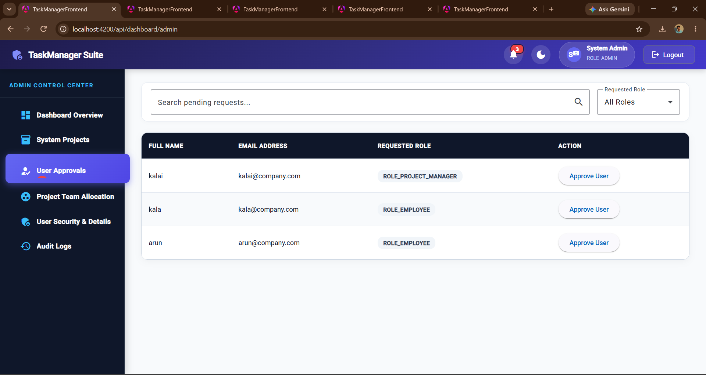

---

## 🔒 User Security Details

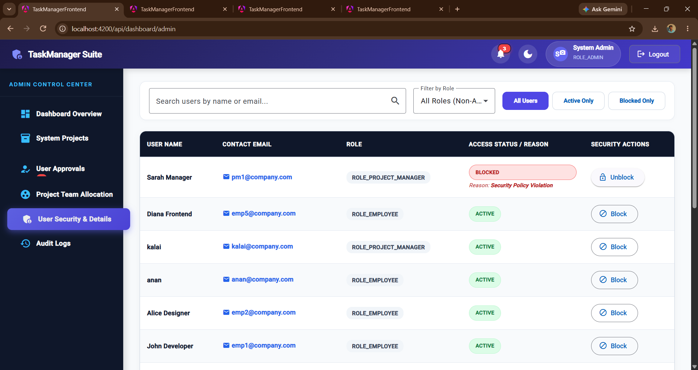

---

## 📋 Audit Logs

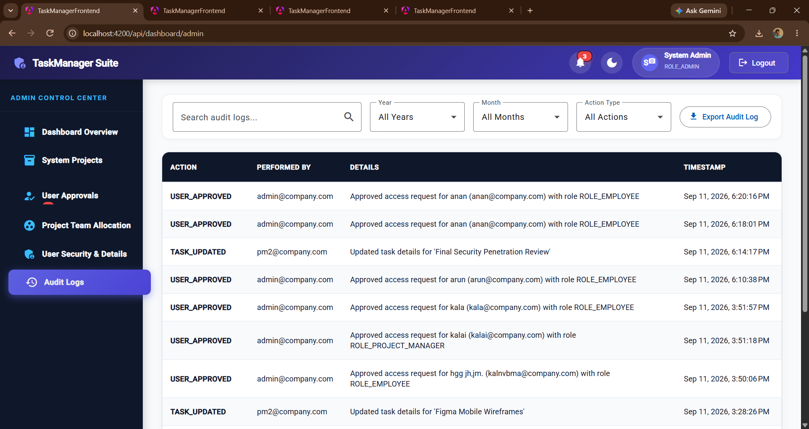

---

## 📦 Bulk Project Upload

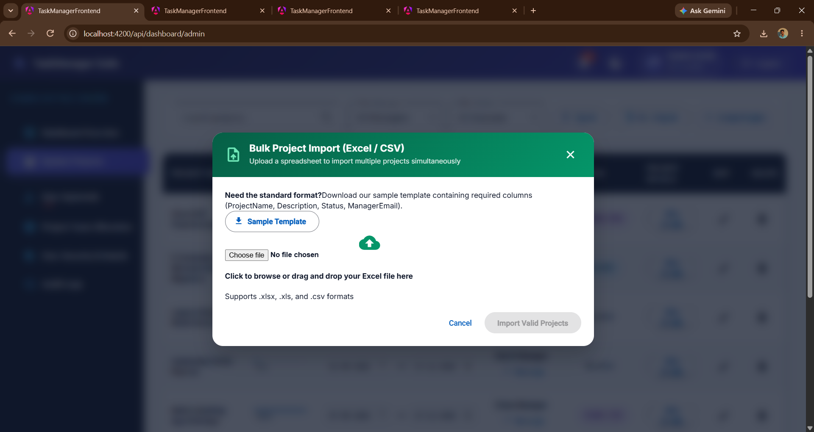

---

## 📝 Bulk Task Upload

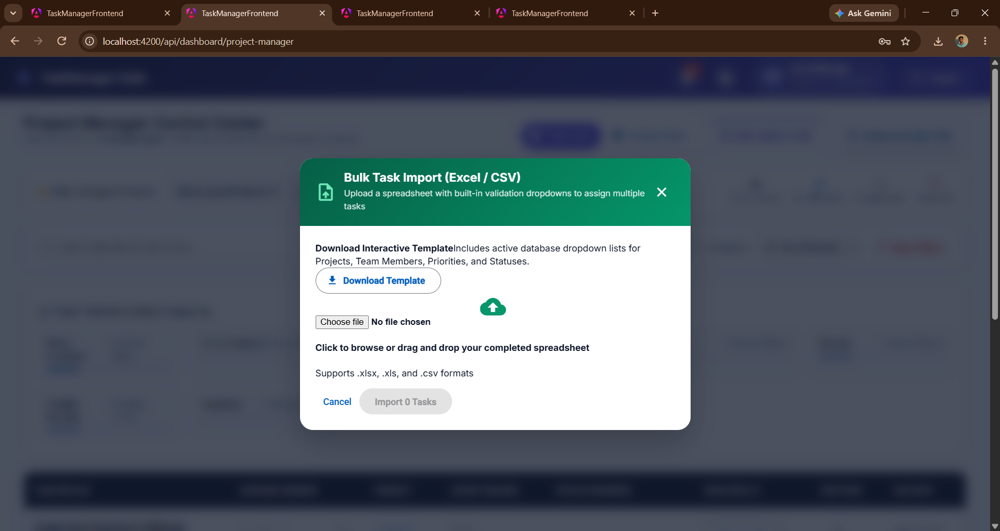

---

## 📊 Project Manager Dashboard

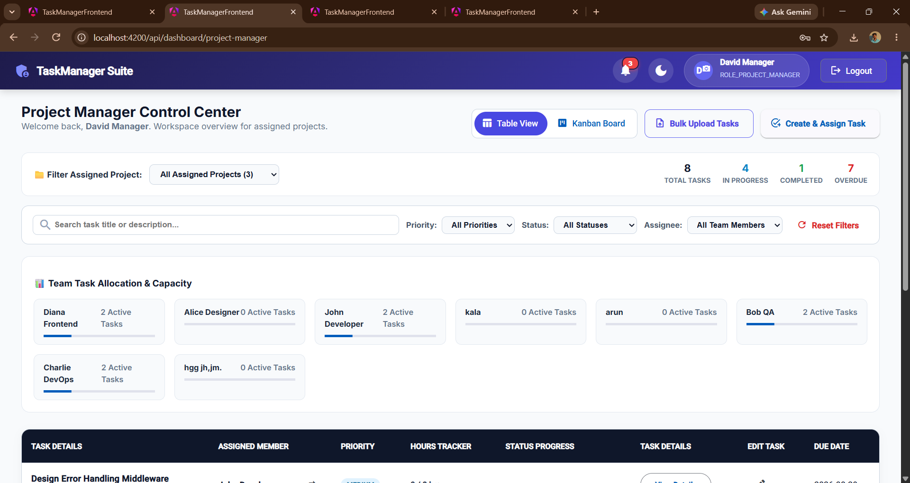

---

## ➕ Create Project

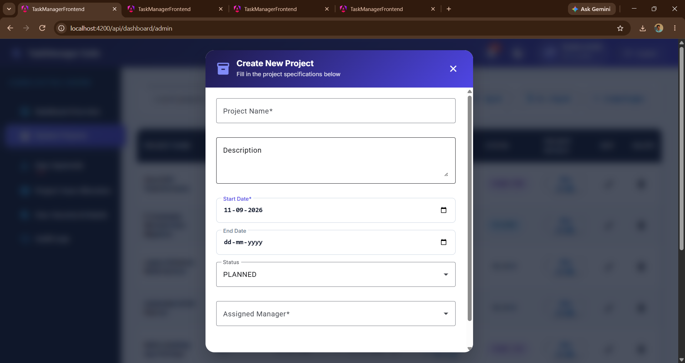

---

## 📂 Project Management

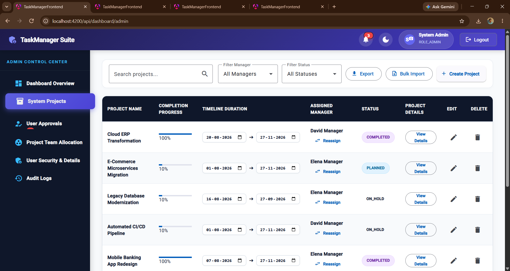

---

## 👥 Project Team Allocation

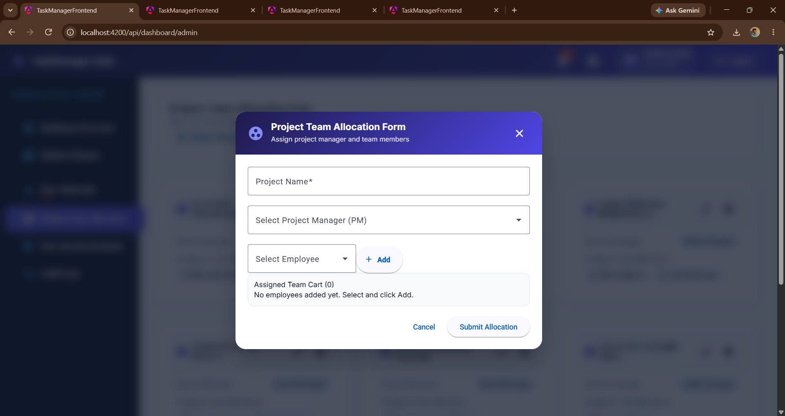

---

## 👨‍👩‍👦 Project Team Management

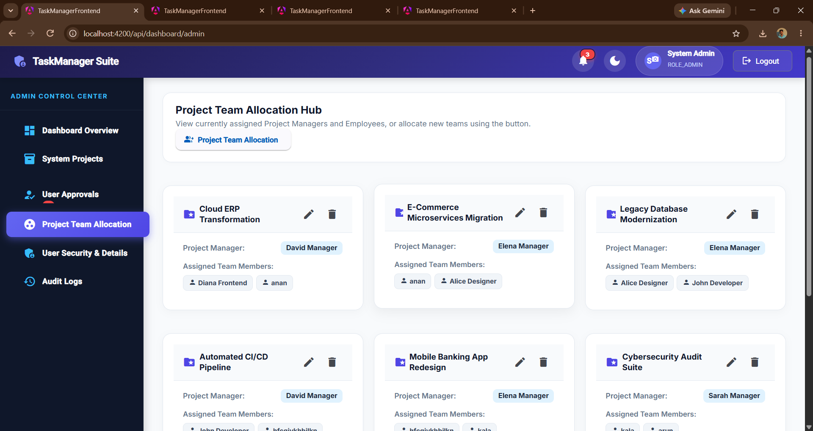

---

## ➕ Create Task

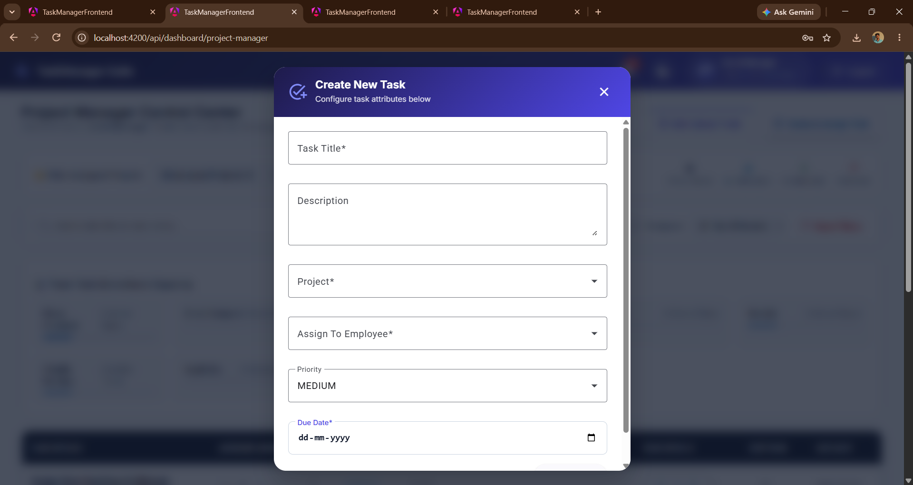

---

## 📋 Task Management

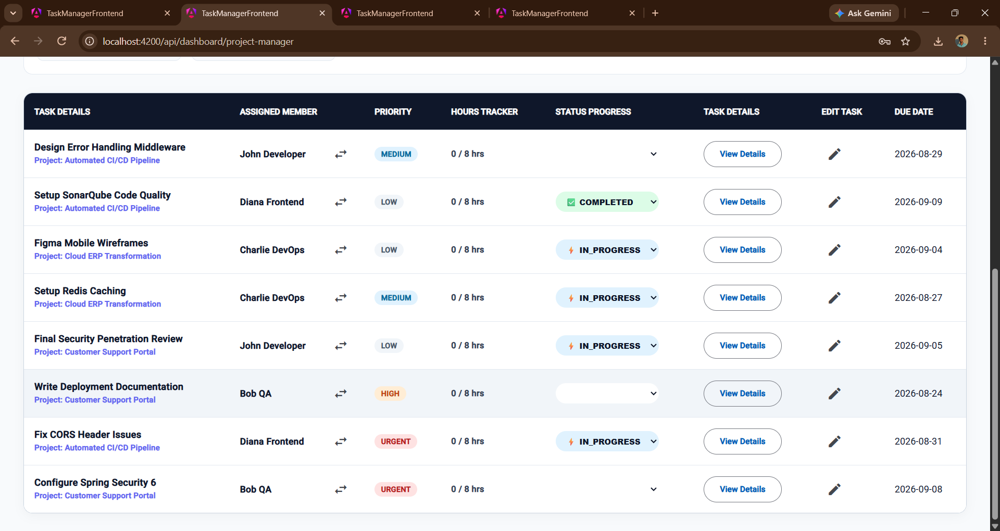

---

## 👨‍💻 Employee Dashboard

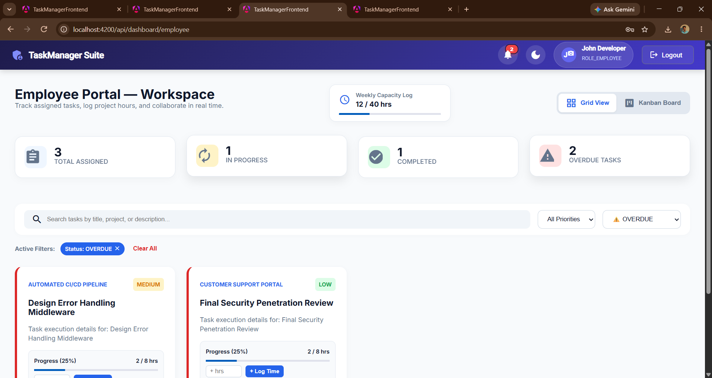

# 🔐 Authentication Architecture

```text
                 User
                  │
                  ↓
          Angular Login Page
                  │
          ┌───────┴────────┐
          ↓                ↓
       JWT Login       Google OAuth2
          │                │
          └───────┬────────┘
                  ↓
          Spring Security
                  ↓
          Role Verification
                  ↓
       Authorized API Access
```

---

# 🧩 Main Modules

| Module             | Responsibility                       |
| ------------------ | ------------------------------------ |
| 🔐 Authentication  | Login, Registration, JWT & OAuth2    |
| 👨‍💼 Admin        | Users, projects, teams and approvals |
| 📊 Project Manager | Projects, tasks and workload         |
| 👨‍💻 Employee     | Assigned tasks and progress          |
| 📋 Task Management | Create, assign and track tasks       |
| 🔔 Notifications   | Role-based system notifications      |
| 👤 Profile         | User profile and avatar              |
| 🎨 UI              | Responsive dashboard and theme       |

---

# ⚙️ Installation & Setup

## 1. Prerequisites

Make sure the following are installed:

```text
Java 21+
Node.js
npm
Angular CLI
MySQL
Maven
Git
```

---

## 2. Clone Repository

```bash
git clone https://github.com/BALAMURUGAN-4735/Task_Management_System.git
```

```bash
cd Task_Management_System
```

---

# 🗄️ Database Configuration

Create or configure the MySQL database.

```text
Database Name:
task_manager_db
```

The backend configuration uses:

```text
jdbc:mysql://localhost:3306/task_manager_db?createDatabaseIfNotExist=true
```

Update your database username and password in the Spring Boot configuration if required.

---

# ⚙️ Run Backend

Navigate to:

```bash
cd backend/task-manager-backend/task-manager-backend
```

Run:

```bash
mvn clean spring-boot:run
```

The Spring Boot backend will start on its configured port.

---

# 💻 Run Frontend

Open another terminal.

Navigate to:

```bash
cd frontend/taskManagerFrontend
```

Install dependencies:

```bash
npm install
```

Run Angular:

```bash
ng serve
```

Open the application in your browser:

```text
http://localhost:4200
```

---

# 🔄 Complete System Workflow

```text
                    USER
                      │
                      ↓
              LOGIN / REGISTER
                      │
                      ↓
             AUTHENTICATION
                      │
                      ↓
               ROLE CHECK
                      │
       ┌──────────────┼──────────────┐
       ↓              ↓              ↓
     ADMIN       PROJECT MANAGER   EMPLOYEE
       │              │              │
       ↓              ↓              ↓
   Manage Users    Manage Tasks    View Tasks
   Manage Teams    Assign Tasks    Update Status
   Projects        Monitor Team    Log Time
   Approvals       Track Progress  Track Progress
       │              │              │
       └──────────────┼──────────────┘
                      ↓
               DATABASE UPDATE
                      │
                      ↓
              DASHBOARD / REPORT
```

---

# 📈 Project Outcome

The project successfully combines:

* Project Management
* Task Assignment
* Employee Collaboration
* Workload Tracking
* Progress Monitoring
* Role-Based Access
* Secure Authentication
* Team Management

into a single full-stack platform.

The application demonstrates practical implementation of **Angular, Spring Boot, Spring Security, REST APIs, JWT, OAuth2, JPA, Hibernate, and MySQL**.

---

# 🎯 Learning Outcomes

Through this project, I gained practical experience in:

* Full-Stack Web Development
* Angular Application Development
* TypeScript
* Java & Spring Boot
* REST API Development
* Spring Security
* JWT Authentication
* Google OAuth2
* Role-Based Authorization
* MySQL Database Integration
* JPA & Hibernate
* Git & GitHub
* Frontend-Backend Integration
* Application Architecture

---

# 🔗 Project Links

### 📦 GitHub Repository

https://github.com/BALAMURUGAN-4735/Task_Management_System

### 🌐 Live Application

https://task-management-system-9kqe.vercel.app/login

---

# 👨‍💻 Author

**Balamurugan M**

Computer Science & Engineering
Full-Stack Development Enthusiast

---

## ⭐ Support

If you find this project useful, consider giving the repository a ⭐ on GitHub.

**Built with ❤️ using Angular, Spring Boot and MySQL.**
